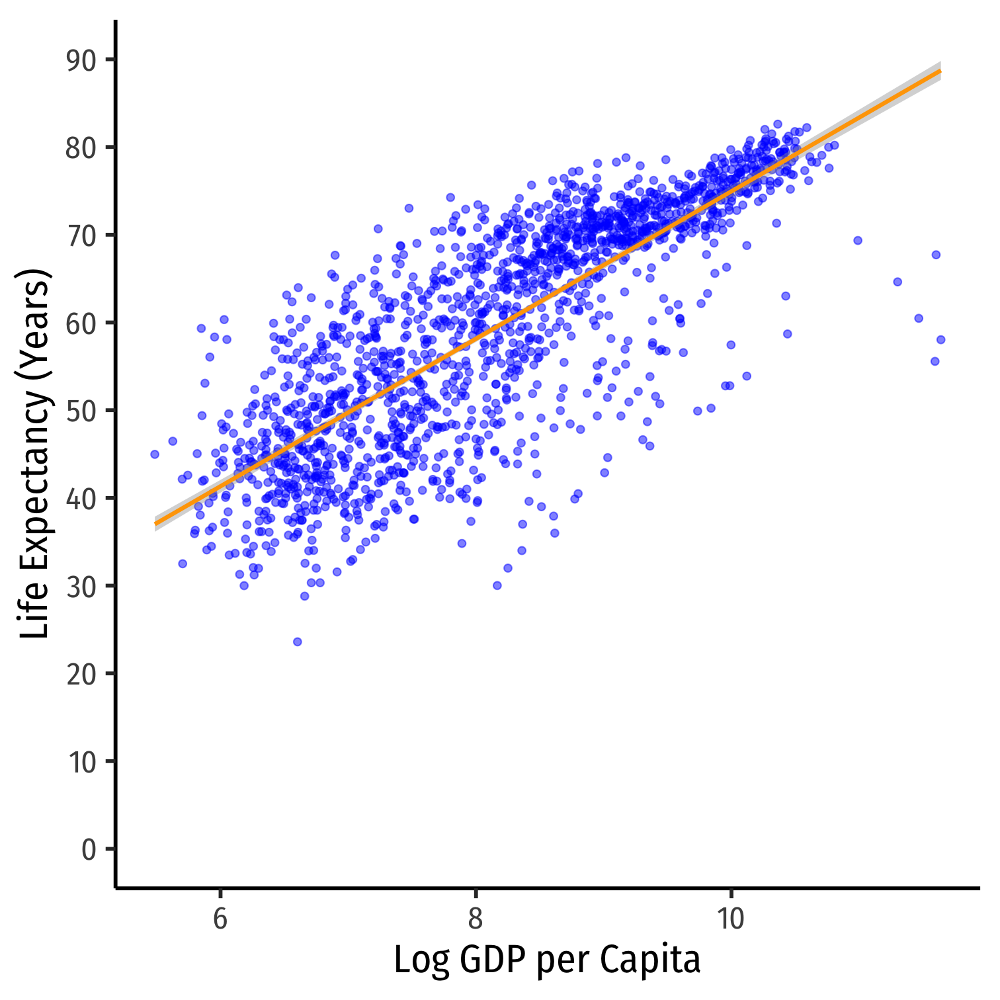
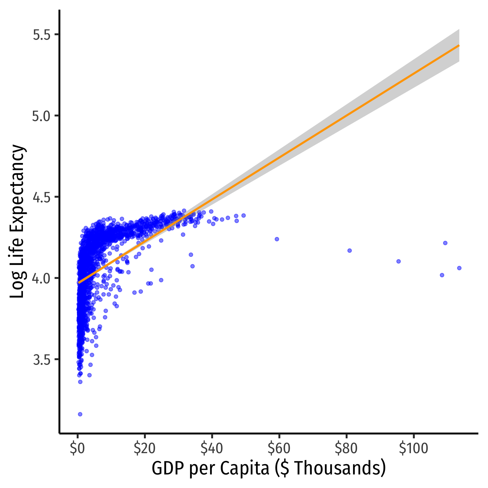
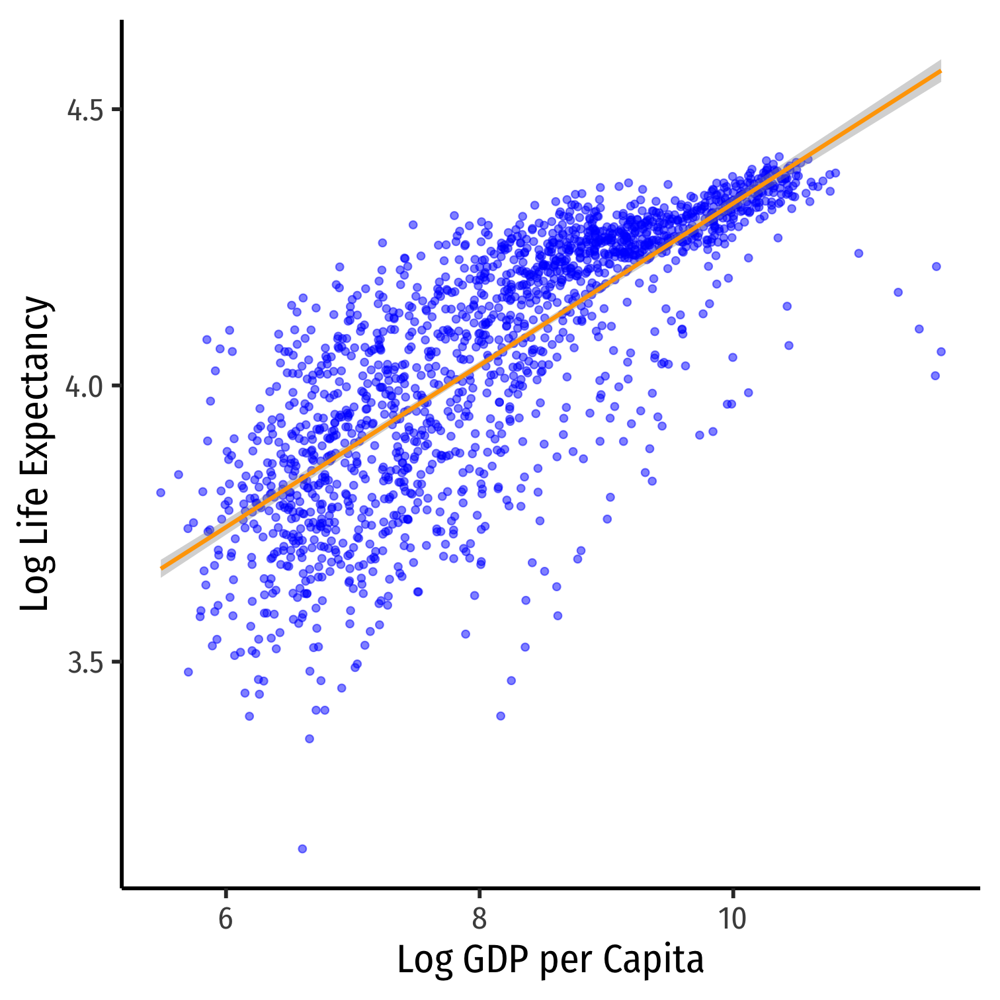

```{r setup, include=FALSE}
options(htmltools.dir.version = FALSE)
knitr::opts_chunk$set(echo=F,
                      message=F,
                      warning=F)
library(tidyverse)
set.seed(256)
update_geom_defaults("label", list(family = "Fira Sans Condensed"))
```


# Nonlinearities

.pull-left[

- Consider the `gapminder` example again
]

.pull-right[

```{r, fig.retina=3}
library(gapminder)
gap_60<-gapminder %>%
  filter(gdpPercap<60000)

p2<-ggplot(data = gap_60)+
  aes(x = gdpPercap,
      y = lifeExp)+
  geom_point(color="blue", alpha=0.5)+
  scale_x_continuous(labels=scales::dollar,
                     breaks=seq(0,60000,20000))+
  scale_y_continuous(breaks=seq(0,90,10),
                     limits=c(0,90))+
  labs(x = "GDP per Capita",
       y = "Life Expectancy (Years)")+
  theme_classic(base_family = "Fira Sans Condensed",
           base_size=20)

p2
```

]

---

# Nonlinearities

.pull-left[

- Consider the `gapminder` example again
  - .red[linear model]
]

.pull-right[

```{r, fig.retina=3}
p2+geom_smooth(method="lm", color="red")
```

]

---

# Nonlinearities

.pull-left[

- Consider the `gapminder` example again
  - .red[linear model]
  - .green[polynomial model (quadratic)]
]

.pull-right[

```{r, fig.retina=3}
p2+geom_smooth(method="lm", color="red")+
  stat_smooth(method="lm", formula=y~x+I(x^2), color = "green")
```

]

---

# Nonlinearities

.pull-left[

- Consider the `gapminder` example again
  - .red[linear model]
  - .green[polynomial model (quadratic)]
  - .orange[logarithmic model]
]

.pull-right[

```{r, fig.retina=3}
p2+geom_smooth(method="lm", color="red")+
  stat_smooth(method="lm", formula=y~x+I(x^2), color = "green")+
  stat_smooth(method = "lm", formula=y~log(x), color="orange", size=2)
```

]

---

class: inverse, center, middle

# Logarithmic Models

---

# Logarithmic Models

.pull-left[
```{r, fig.retina=3}
ggplot(data.frame(x=0:10),aes(x=x))+
    stat_function(fun=log, color="blue",size =2)+
  geom_label(x=9,y=log(9), label="y=log(x)", color="blue", size=5)+
  scale_x_continuous(breaks=seq(0,10,1),
                     limits=c(0,10),
                     expand=c(0,0))+
  scale_y_continuous(limits=c(0,2.5),
                     expand=c(0,0))+
  labs(x = "X",
       y = "Y")+
  theme_classic(base_family = "Fira Sans Condensed",
           base_size=20)
```
]

.pull-right[

- Another model specification for nonlinear data is the .shout[logarithmic model]<sup>.red[1]</sup>
  - We transform either $X$, $Y$, or *both* by taking the (natural) logarithm

- Logarithmic model has two additional advantages
  1. We can easily interpret coefficients as **percentage changes** or **elasticities**
  2. Useful economic shape: diminishing returns (production functions, utility functions, etc)


.footnote[<sup>.red[1]</sup> Note, this should not be confused with a **logistic model**, which is a model for dependent dummy variables.]

]

---

# The Natural Logarithm

.pull-left[
```{r, fig.retina=3}
ggplot(data.frame(x=0:10),aes(x=x))+
    stat_function(fun=log, color="blue",size =2)+
    stat_function(fun=exp, color="red", size =2)+
  stat_function(fun=function(x){x}, size=2, linetype="dashed")+
  geom_label(x=4,y=log(4), label=expression(Y==ln(X)), color="blue", size=5)+
  geom_label(x=1,y=exp(1), label=expression(Y==e^{X}), color="red", size=5)+
  scale_x_continuous(breaks=seq(0,5,1),
                     limits=c(0,5),
                     expand=c(0,0))+
  scale_y_continuous(limits=c(0,5),
                     expand=c(0,0))+
  labs(x = "X",
       y = "Y")+
  theme_classic(base_family = "Fira Sans Condensed",
           base_size=20)
```
]

.pull-right[

- The .red[exponential function], $Y=e^X$ or $Y=exp(X)$, where base $e=2.71828...$

- .blue[Natural logarithm] is the inverse, $Y=ln(X)$

]

---

# The Natural Logarithm: Review I

- **Exponents** are defined as
$$b^n=\underbrace{b \times b \times \cdots \times b}_{n \text{ times}}$$
  - where base $b$ is multiplied by itself $n$ times

--
- .green[**Example**]: $2^3=\underbrace{2 \times 2 \times 2}_{n=3}=8$

--

- **Logarithms** are the inverse, defined as the exponents in the expressions above
$$\text{If } b^n=y\text{, then }log_b(y)=n$$
  - $n$ is the number you must raise $b$ to in order to get $y$

--

- .green[**Example**]: $log_2(8)=3$

---

# The Natural Logarithm: Review II

- Logarithms can have any base, but common to use the **natural logarithm $(ln)$** with base $\mathbf{e=2.71828...}$
$$\text{If } e^n=y\text{, then }ln(y)=n$$

---

# The Natural Logarithm: Properties

- Natural logs have a lot of useful properties:

1. $ln(\frac{1}{x})=-ln(x)$

2. $ln(ab)=ln(a)+ln(b)$

3.  $ln(\frac{x}{a})=ln(x)-ln(a)$

4. $ln(x^a)=a \, ln(x)$

5.  $\frac{d  \, ln \, x}{d \, x} = \frac{1}{x}$

---

# The Natural Logarithm: Example

- Most useful property: for small change in $x$, $\Delta x$:

$$\underbrace{ln(x+\Delta x) - ln(x)}_{\text{Difference in logs}} \approx \underbrace{\frac{\Delta x}{x}}_{\text{Relative change}}$$

--

.content-box-green[
.green[**Example**]: Let $x=100$ and $\Delta x =1$, relative change is:

$$\frac{\Delta x}{x} = \frac{(101-100)}{100} = 0.01 \text{ or }1\%$$

- The logged difference:
$$ln(101)-ln(100) = 0.00995 \approx 1\%$$
]

--

- This allows us to very easily interpret coefficients as *percent changes* or **elasticities**

---

# Elasticity

- An .shout[elasticity] between two variables, $E_{Y,X}$ describes the .onfire[responsiveness] of one variable to a change in another

- Measured in percentages: a 1% change in $X$ will cause a $E\%$ change in $Y$

--

$$E_{Y,X}=\frac{\% \Delta Y}{\% \Delta X} =\cfrac{\left(\frac{\Delta Y}{Y}\right)}{\left( \frac{\Delta X}{X}\right)}$$

--

- Numerator is relative change in $Y$, Denominator is relative change in $X$

---

# Math FYI: Cobb Douglas Functions and Logs

- One of the (many) reasons why economists love Cobb-Douglas functions:
$$Y=AL^{\alpha}K^{\beta}$$

--

- Taking logs, relationship becomes linear:

--

$$ln(Y)=ln(A)+\alpha ln(L)+ \beta ln(K)$$

--

- With data on $(Y, L, K)$ and linear regression, can estimate $\alpha$ and $\beta$
  - $\alpha$: elasticity of $Y$ with respect to $L$
      - A 1% change in $L$ will lead to an $\alpha$% change in $Y$
  - $\beta$: elasticity of $Y$ with respect to $K$
      - A 1% change in $K$ will lead to a $\beta$% change in $Y$

---

# Logarithms in R I

- The `log()` function can easily take the logarithm

```{r, echo=T}
gapminder<-gapminder %>%
  mutate(loggdp=log(gdpPercap)) # log GDP per capita

gapminder %>% head() # look at it
```

---

# Logarithms in R II


- Note, `log()` by default is the **natural logarithm $ln()$**, i.e. base `e`
  - Can change base with e.g. `log(x, base = 5)`
  - Some common built-in logs: `log10`, `log2` 

```{r, echo=T}
log10(100)
log2(16)
log(19683, base=3)
```

---

# Types of Logarithmic Models

- Three types of log regression models, depending on which variables we log

--

1.  **Linear-log model:** $Y_i=\beta_0+\beta_1$ .red[`\\(ln(X_i)\\)`]

--

2. **Log-linear model:** .red[`\\(ln(Y_i)\\)`] $=\beta_0+\beta_1X_i$

--

3. **Log-log model:** .red[`\\(ln(Y_i)\\)`] $=\beta_0+\beta_1$ .red[`\\(ln(X_i)\\)`]

---

# Linear-Log Model

- .shout[Linear-log model] has an independent variable $(X)$ that is logged

--

$$\begin{align*}
Y&=\beta_0+\beta_1 \mathbf{ln(X)}\\
\beta_1&=\cfrac{\Delta Y}{\big(\frac{\Delta X}{X}\big)}\\
\end{align*}$$

--

- .onfire[**Marginal effect of** `\\(\mathbf{X \rightarrow Y}\\)`: a **1%** change in `\\(X \rightarrow\\)` a `\\(\frac{\beta_1}{100}\\)` **unit** change in `\\(Y\\)`]

---

# Linear-Log Model in R

.pull-left[
```{r, echo=T}
lin_log_reg<-lm(lifeExp~loggdp, data = gapminder)
library(broom)
tidy(lin_log_reg)
```
]

.pull-right[

$$\widehat{\text{Life Expectancy}}_i=-9.10+9.41 \, \text{ln(GDP)}_i$$


]

---

# Linear-Log Model in R

.pull-left[
```{r, echo=T}
lin_log_reg<-lm(lifeExp~loggdp, data = gapminder)
library(broom)
tidy(lin_log_reg)
```
]

.pull-right[

$$\widehat{\text{Life Expectancy}}_i=-9.10+9.41 \, \text{ln(GDP)}_i$$

- A **1% change in GDP** $\rightarrow$ a $\frac{9.41}{100}=$ **0.0941 year increase** in Life Expectancy


]

---

# Linear-Log Model in R

.pull-left[
```{r, echo=T}
lin_log_reg<-lm(lifeExp~loggdp, data = gapminder)
library(broom)
tidy(lin_log_reg)
```
]

.pull-right[

$$\widehat{\text{Life Expectancy}}_i=-9.10+9.41 \, \text{ln(GDP)}_i$$

- A **1% change in GDP** $\rightarrow$ a $\frac{9.41}{100}=$ **0.0941 year increase** in Life Expectancy

- A **25% fall in GDP** $\rightarrow$ a $(-25 \times 0.0941)=$ **2.353 year decrease** in Life Expectancy


]

---

# Linear-Log Model in R

.pull-left[
```{r, echo=T}
lin_log_reg<-lm(lifeExp~loggdp, data = gapminder)
library(broom)
tidy(lin_log_reg)
```
]

.pull-right[

$$\widehat{\text{Life Expectancy}}_i=-9.10+9.41 \, \text{ln(GDP)}_i$$

- A **1% change in GDP** $\rightarrow$ a $\frac{9.41}{100}=$ **0.0941 year increase** in Life Expectancy

- A **25% fall in GDP** $\rightarrow$ a $(-25 \times 0.0941)=$ **2.353 year decrease** in Life Expectancy

- A **100% rise in GDP** $\rightarrow$ a $(100 \times 0.0941)=$ **9.041 year increase** in Life Expectancy 

]

---

# Linear-Log Model Graph I

.pull-left[
```{r lin-log-graph, echo=T, eval=F}
ggplot(data = gapminder)+
  aes(x = gdpPercap,
      y = lifeExp)+
  geom_point(color="blue", alpha=0.5)+
  geom_smooth(method="lm", #<<
              formula=y~log(x), #<<
              color="orange")+ #<<
  scale_x_continuous(labels=scales::dollar,
                     breaks=seq(0,120000,20000))+
  scale_y_continuous(breaks=seq(0,90,10),
                     limits=c(0,90))+
  labs(x = "GDP per Capita",
       y = "Life Expectancy (Years)")+
  theme_classic(base_family = "Fira Sans Condensed",
           base_size=20)
```
]

.pull-right[
```{r, ref.label="lin-log-graph", fig.retina=3}

```
]

---

# Linear-Log Model Graph II

.pull-left[
```{r lin-log-graph2, echo=T, eval=F}
ggplot(data = gapminder)+
  aes(x = loggdp, #<<
      y = lifeExp)+ 
  geom_point(color="blue", alpha=0.5)+
  geom_smooth(method="lm", color="orange")+ #<<
  scale_y_continuous(breaks=seq(0,90,10),
                     limits=c(0,90))+
  labs(x = "Log GDP per Capita",
       y = "Life Expectancy (Years)")+
  theme_classic(base_family = "Fira Sans Condensed",
           base_size=20)
```
]

.pull-right[
```{r, ref.label="lin-log-graph2", fig.retina=3}

```
]

---

# Log-Linear Model

- .shout[Log-linear model] has the dependent variable $(Y)$ logged

--

$$\begin{align*}
\mathbf{ln(Y)}&=\beta_0+\beta_1 X\\
\beta_1&=\cfrac{\big(\frac{\Delta Y}{Y}\big)}{\Delta X}\\
\end{align*}$$

--

- .onfire[**Marginal effect of** `\\(\mathbf{X \rightarrow Y}\\)`: a **1 unit** change in `\\(X \rightarrow\\)` a `\\(\beta_1 \times 100\\)` **%** change in `\\(Y\\)`]

---

# Log-Linear Model in R (Preliminaries)

- We will again have very large/small coefficients if we deal with GDP directly, again let's transform `gdpPercap` into $1,000s, call it `gdp_t`

- Then log LifeExp

--

```{r, echo=T}
gapminder <- gapminder %>%
  mutate(gdp_t=gdpPercap/1000, # first make GDP/capita in $1000s
         loglife=log(lifeExp)) # take the log of LifeExp
gapminder %>% head() # look at it
```

---

# Log-Linear Model in R

.pull-left[
```{r, echo=T}
log_lin_reg<-lm(loglife~gdp_t, data = gapminder)
tidy(log_lin_reg)
```
]

.pull-right[

$$\widehat{ln(\text{Life Expectancy})}_i=3.967+0.013 \, \text{GDP}_i$$


]

---

# Log-Linear Model in R

.pull-left[
```{r, echo=T}
log_lin_reg<-lm(loglife~gdp_t, data = gapminder)
tidy(log_lin_reg)
```
]

.pull-right[

$$\widehat{ln(\text{Life Expectancy})}_i=3.967+0.013 \, \text{GDP}_i$$

- A **$1 (thousand) change in GDP** $\rightarrow$ a $0.013 \times 100\%=$ **1.3% increase** in Life Expectancy

]

---

# Log-Linear Model in R

.pull-left[
```{r, echo=T}
log_lin_reg<-lm(loglife~gdp_t, data = gapminder)
tidy(log_lin_reg)
```
]

.pull-right[

$$\widehat{ln(\text{Life Expectancy})}_i=3.967+0.013 \, \text{GDP}_i$$

- A **$1 (thousand) change in GDP** $\rightarrow$ a $0.013 \times 100\%=$ **1.3% increase** in Life Expectancy

- A **$25 (thousand) fall in GDP** $\rightarrow$ a $(-25 \times 1.3\%)=$ **32.5% decrease** in Life Expectancy 


]

---

# Log-Linear Model in R

.pull-left[
```{r, echo=T}
log_lin_reg<-lm(loglife~gdp_t, data = gapminder)
tidy(log_lin_reg)
```
]

.pull-right[

$$\widehat{ln(\text{Life Expectancy})}_i=3.967+0.013 \, \text{GDP}_i$$

- A **$1 (thousand) change in GDP** $\rightarrow$ a $0.013 \times 100\%=$ **1.3% increase** in Life Expectancy

- A **$25 (thousand) fall in GDP** $\rightarrow$ a $(-25 \times 1.3\%)=$ **32.5% decrease** in Life Expectancy 

- A **$100 (thousand) rise in GDP** $\rightarrow$ a $(100 \times 1.3\%)=$ **130% increase** in Life Expectancy 

]

---

# Linear-Log Model Graph I

.pull-left[
```{r log-lin-graph, echo=T, eval=F}
ggplot(data = gapminder)+
  aes(x = gdp_t, #<<
      y = loglife)+ #<<
  geom_point(color="blue", alpha=0.5)+
  geom_smooth(method="lm", color="orange")+ #<<
  scale_x_continuous(labels=scales::dollar,
                     breaks=seq(0,120,20))+
  labs(x = "GDP per Capita ($ Thousands)",
       y = "Log Life Expectancy")+
  theme_classic(base_family = "Fira Sans Condensed",
           base_size=20)
```
]

.pull-right[
```{r, ref.label="log-lin-graph", fig.retina=3}

```
]

---

# Log-Log Model

- .shout[Log-log model] has both variables $(X \text{ and } Y)$ logged

--

$$\begin{align*}
\mathbf{ln(Y)}&=\beta_0+\beta_1 \mathbf{ln(X)}\\
\beta_1&=\cfrac{\big(\frac{\Delta Y}{Y}\big)}{\big(\frac{\Delta X}{X}\big)}\\
\end{align*}$$

--

- .onfire[**Marginal effect of** `\\(\mathbf{X \rightarrow Y}\\)`: a **1%** change in `\\(X \rightarrow\\)` a `\\(\beta_1\\)` **%** change in `\\(Y\\)`]

- $\beta_1$ is the **elasticity** of $Y$ with respect to $X$! 

---

# Log-Log Model in R

.pull-left[
```{r, echo=T}
log_log_reg<-lm(loglife~loggdp, data = gapminder)
tidy(log_log_reg)
```
]

.pull-right[

$$\widehat{\text{ln(Life Expectancy)}}_i=2.864+0.147 \, \text{ln(GDP)}_i$$


]

---

# Log-Log Model in R

.pull-left[
```{r, echo=T}
log_log_reg<-lm(loglife~loggdp, data = gapminder)
tidy(log_log_reg)
```
]

.pull-right[

$$\widehat{\text{ln(Life Expectancy)}}_i=2.864+0.147 \, \text{ln(GDP)}_i$$

- A **1% change in GDP** $\rightarrow$ a **0.147% increase** in Life Expectancy

]

---

# Log-Log Model in R

.pull-left[
```{r, echo=T}
log_log_reg<-lm(loglife~loggdp, data = gapminder)
tidy(log_log_reg)
```
]

.pull-right[

$$\widehat{\text{ln(Life Expectancy)}}_i=2.864+0.147 \, \text{ln(GDP)}_i$$

- A **1% change in GDP** $\rightarrow$ a **0.147% increase** in Life Expectancy

- A **25% fall in GDP** $\rightarrow$ a $(-25 \times 0.147\%)=$ **3.675% decrease** in Life Expectancy 


]

---

# Log-Log Model in R

.pull-left[
```{r, echo=T}
log_log_reg<-lm(loglife~loggdp, data = gapminder)
tidy(log_log_reg)
```
]

.pull-right[

$$\widehat{\text{ln(Life Expectancy)}}_i=2.864+0.147 \, \text{ln(GDP)}_i$$

- A **1% change in GDP** $\rightarrow$ a **0.147% increase** in Life Expectancy

- A **25% fall in GDP** $\rightarrow$ a $(-25 \times 0.147\%)=$ **3.675% decrease** in Life Expectancy 

- A **100% rise in GDP** $\rightarrow$ a $(100 \times 0.147\%)=$ **14.7% increase** in Life Expectancy 

]

---

# Log-Log Model Graph I

.pull-left[
```{r log-log-graph, echo=T, eval=F}
ggplot(data = gapminder)+
  aes(x = loggdp, #<<
      y = loglife)+ #<<
  geom_point(color="blue", alpha=0.5)+
  geom_smooth(method="lm", color="orange")+ #<<
  labs(x = "Log GDP per Capita",
       y = "Log Life Expectancy")+
  theme_classic(base_family = "Fira Sans Condensed",
           base_size=20)
```
]

.pull-right[
```{r, ref.label="log-log-graph", fig.retina=3}

```
]

---

# Comparing Models I

| Model | Equation | Interpretation |
|-------|----------|----------------|
| Linear-**Log** | $Y=\beta_0+\beta_1 \mathbf{ln(X)}$ | 1% change in $X \rightarrow \frac{\hat{\beta_1}}{100}$ **unit** change in $Y$ |
| **Log**-Linear | $\mathbf{ln(Y)}=\beta_0+\beta_1X$ | 1 **unit** change in $X \rightarrow \hat{\beta_1}\times 100$**%** change in $Y$ |
| **Log**-**Log** | $\mathbf{ln(Y)}=\beta_0+\beta_1\mathbf{ln(X)}$ | 1**%** change in $X \rightarrow \hat{\beta_1}$**%** change in $Y$ |

- Hint: the variable that gets logged changes in **percent** terms, the variable not logged changes in *unit* terms

---

# Comparing Models II

.pull-left[
```{r logs-table, echo=T, eval=F}
library(huxtable)
huxreg("Life Exp." = lin_log_reg,
       "Log Life Exp." = log_lin_reg,
       "Log Life Exp." = log_log_reg,
       coefs = c("Constant" = "(Intercept)",
                 "GDP ($1000s)" = "gdp_t",
                 "Log GDP" = "loggdp"),
       statistics = c("N" = "nobs",
                      "R-Squared" = "r.squared",
                      "SER" = "sigma"),
       number_format = 2)
```

- Models are very different units, how to choose? 
  - Compare $R^2$'s
  - Compare graphs
  - Compare intution

]

.pull-left[
```{r, ref.label="logs-table"}
```

]

---

# Comparing Models III

| Linear-Log | Log-Linear | Log-Log |
|:----------:|:----------:|:-------:|
|  |  |  |
| $\hat{Y_i}=\hat{\beta_0}+\hat{\beta_1}\mathbf{ln(X_i)}$ | $\mathbf{ln(\hat{Y_i})}=\hat{\beta_0}+\hat{\beta_1}X_i$ | $\mathbf{ln(\hat{Y_i})}=\hat{\beta_0}+\hat{\beta_1}\mathbf{ln(X_i)}$ |
| $R^2=0.65$ | $R^2=0.30$ | $R^2=0.61$ |


---

# When to Log?

- In practice, the following types of variables are logged:
  - Variables that must always be positive (prices, sales, market values)
  - Very large numbers (population, GDP)
  - Variables we want to talk about as percentage changes or growth rates (money supply, population, GDP)
  - Variables that have diminishing returns (output, utility)
  - Variables that have nonlinear scatterplots

--

- Avoid logs for:
  - Variables that are less than one, decimals, 0, or negative
  - Categorical variables (season, gender, political party)
  - Time variables (year, week, day)

---

class: inverse, center, middle

# Comparing Across Units

---

# Comparing Coefficients of Different Units I

$$\hat{Y_i}=\beta_0+\beta_1 X_1+\beta_2 X_2	$$

- We often want to compare coefficients to see which variable $X_1$ or $X_2$ has a bigger effect on $Y$

- What if $X_1$ and $X_2$ are different units?

.content-box-green[
.green[**Example**]:
$$\begin{align*}
\widehat{\text{Salary}_i}&=\beta_0+\beta_1\, \text{Batting average}_i+\beta_2\, \text{Home runs}_i\\
\widehat{\text{Salary}_i}&=-\text{2,869,439.40}+\text{12,417,629.72} \, \text{Batting average}_i+\text{129,627.36}\, \text{Home runs}_i\\
\end{align*}$$
]

---

# Comparing Coefficients of Different Units II

- An easy way is to .shout[standardize] the variables (i.e. take the $Z$-score) 

$$X^{std}=\frac{X-\overline{X}}{sd(X)}$$

---

# Comparing Coefficients of Different Units: Example

| Variable | Mean | Std. Dev. |
|----------|------|-----------|
| Salary | $2,024,616 | $2,764,512 |
| Batting Average | 0.267 | 0.031 |
| Home Runs | 12.11 | 10.31 |

$$\begin{align*}\scriptsize  
	\widehat{\text{Salary}_i}&=-\text{2,869,439.40}+\text{12,417,629.72} \, \text{Batting average}_i+\text{129,627.36} \, \text{Home runs}_i\\ 
	\widehat{\text{Salary}_i}^{std}&=\text{0.00}+\text{0.14} \, \text{Batting average}_i^{std}+\text{0.48} \, \text{Home runs}_i^{std}\\
	\end{align*}$$
	
--

- .onfire[Marginal effect] on $Y$ (in *standard deviations* of $Y$) from 1 *standard deviation* change in $X$
  - $\hat{\beta_1}$: a 1 standard deviation increase in Batting Average increases Salary by 0.14 standard deviations
    - $0.14 \times 2,764,512=\$387,032$
  - $\hat{\beta_2}$: a 1 standard deviation increase in Home Runs increases Salary by 0.48 standard deviations
    - $0.48 \times 2,764,512=\$1,326,966$
    
---

# Standardizing in `R`

- Use the `scale()` command inside `mutate()` function to standardize a variable

```{r, echo=T}
gapminder<-gapminder %>%
  mutate(std_life = scale(lifeExp),
         std_gdp = scale(gdpPercap)) 

std_reg<-lm(std_life~std_gdp, data = gapminder)
tidy(std_reg)
```

---

class: inverse, center, middle

# Joint Hypothesis Testing

---

# Joint Hypothesis Testing I

.content-box-green[
.green[**Example**]: Return again to:

$$\widehat{Wage_i}=\hat{\beta_0}+\hat{\beta_1}Male+\hat{\beta_2}Northeast_i+\hat{\beta_3}Midwest_i+\hat{\beta_4}South_i$$

]

--

- Maybe region doesn't affect wages *at all*?

--

- $H_0: \beta_2=0, \, \beta_3=0, \, \beta_4=0$

--

- This is a .shout[joint hypothesis] to test

---

# Joint Hypothesis Testing II

- A .shout[joint hypothesis] tests against the null hypothesis of a value for *multiple* parameters:
$$\mathbf{H_0: \beta_1= \beta_2=0}$$
the hypotheses that multiple regressors are equal to zero (have no causal effect on the outcome) 

--

- Our **alternative hypothesis** is that:
$$H_1: \text{ either } \beta_1\neq0\text{ or } \beta_2\neq0\text{ or both}$$
or simply, that $H_0$ is not true 

---

# Types of Joint Hypothesis Tests

- Three main cases of joint hypothesis tests:

--

1. $H_0$: $\beta_1=\beta_2=0$
  - Testing against the claim that multiple variables don't matter
  - Useful under high multicollinearity between variables
  - $H_a$: at least one parameter $\neq$ 0

--

2. $H_0$: $\beta_1=\beta_2$
  - Testing whether two variables matter the same
  - Variables must be the same units
  - $H_a: \beta_1 (\neq, <, \text{ or }>) \beta_2$

--

3. $H_0:$ ALL $\beta$'s $=0$
  - The "**Overall F-test"**
  - Testing against claim that regression model explains *NO* variation in $Y$

---

# Joint Hypothesis Tests: F-statistic

- The .shout[F-statistic] is the test-statistic used to test joint hypotheses about regression coefficients with an .shout[F-test]

--

- This involves comparing two models:
  1. **Unrestricted model**: regression with all coefficients
  2. **Restricted model**: regression under null hypothesis (coefficients equal hypothesized values)

--

- $F$ is an .onfire[analysis of variance (ANOVA)]
  - essentially tests whether $R^2$ increases statistically significantly as we go from the restricted model$\rightarrow$unrestricted model

--

- $F$ has its own distribution, with *two* sets of degrees of freedom 

---

# Joint Hypothesis F-test: Example I

.content-box-green[
.green[**Example**]: Return again to:

$$\widehat{Wage_i}=\hat{\beta_0}+\hat{\beta_1}Male_i+\hat{\beta_2}Northeast_i+\hat{\beta_3}Midwest_i+\hat{\beta_4}South_i$$

]

--

- $H_0: \beta_2=\beta_3=\beta_4=0$

--

- $H_a$: $H_0$ is not true (at least one $\beta_i \neq 0$)

---

# Joint Hypothesis F-test: Example II

.content-box-green[
.green[**Example**]: Return again to:

$$\widehat{Wage_i}=\hat{\beta_0}+\hat{\beta_1}Male_i+\hat{\beta_2}Northeast_i+\hat{\beta_3}Midwest_i+\hat{\beta_4}South_i$$

]

- **Unrestricted model**:

$$\widehat{Wage_i}=\hat{\beta_0}+\hat{\beta_1}Male_i+\hat{\beta_2}Northeast_i+\hat{\beta_3}Midwest_i+\hat{\beta_4}South_i$$

--

- **Restricted model**:

$$\widehat{Wage_i}=\hat{\beta_0}+\hat{\beta_1}Male_i$$

--

- $F$: does going from restricted to unrestricted statistically significantly improve $R^2$?

---

# Calculating the F-statistic

.pull-left[
$$F_{q,(n-k-1)}=\cfrac{\left(\displaystyle\frac{(R^2_u-R^2_r)}{q}\right)}{\left(\displaystyle\frac{(1-R^2_u)}{(n-k-1)}\right)}$$
]

.pull-right[

]

---

# Calculating the F-statistic

.pull-left[
$$F_{q,(n-k-1)}=\cfrac{\left(\displaystyle\frac{(R^2_u-R^2_r)}{q}\right)}{\left(\displaystyle\frac{(1-R^2_u)}{(n-k-1)}\right)}$$
]

.pull-right[

- $R^2_u$: the $R^2$ from the **unrestricted model** (all variables)
]

---

# Calculating the F-statistic

.pull-left[
$$F_{q,(n-k-1)}=\cfrac{\left(\displaystyle\frac{(R^2_u-R^2_r)}{q}\right)}{\left(\displaystyle\frac{(1-R^2_u)}{(n-k-1)}\right)}$$
]

.pull-right[

- $R^2_u$: the $R^2$ from the **unrestricted model** (all variables)

- $R^2_r$: the $R^2$ from the **restricted model** (null hypothesis)
]

---

# Calculating the F-statistic

.pull-left[
$$F_{q,(n-k-1)}=\cfrac{\left(\displaystyle\frac{(R^2_u-R^2_r)}{q}\right)}{\left(\displaystyle\frac{(1-R^2_u)}{(n-k-1)}\right)}$$
]

.pull-right[

- $R^2_u$: the $R^2$ from the **unrestricted model** (all variables)

- $R^2_r$: the $R^2$ from the **restricted model** (null hypothesis)

- $q$: number of restrictions (number of $\beta's=0$ under null hypothesis)
]

---

# Calculating the F-statistic

.pull-left[
$$F_{q,(n-k-1)}=\cfrac{\left(\displaystyle\frac{(R^2_u-R^2_r)}{q}\right)}{\left(\displaystyle\frac{(1-R^2_u)}{(n-k-1)}\right)}$$
]

.pull-right[

- $R^2_u$: the $R^2$ from the **unrestricted model** (all variables)

- $R^2_r$: the $R^2$ from the **restricted model** (null hypothesis)

- $q$: number of restrictions (number of $\beta's=0$ under null hypothesis)

- $k$: number of $X$ variables in **unrestricted model** (all variables)
]

---

# Calculating the F-statistic

.pull-left[
$$F_{q,(n-k-1)}=\cfrac{\left(\displaystyle\frac{(R^2_u-R^2_r)}{q}\right)}{\left(\displaystyle\frac{(1-R^2_u)}{(n-k-1)}\right)}$$
]

.pull-right[

- $R^2_u$: the $R^2$ from the **unrestricted model** (all variables)

- $R^2_r$: the $R^2$ from the **restricted model** (null hypothesis)

- $q$: number of restrictions (number of $\beta's=0$ under null hypothesis)

- $k$: number of $X$ variables in **unrestricted model** (all variables)

- $F$ has two sets of degrees of freedom, $q$ for the numerator, $n-k-1$ for the denominator
]

---

# Calculating the F-statistic II

.pull-left[
$$F_{q,(n-k-1)}=\cfrac{\left(\displaystyle\frac{(R^2_u-R^2_r)}{q}\right)}{\left(\displaystyle\frac{(1-R^2_u)}{(n-k-1)}\right)}$$
]

.pull-right[

- .onfire[Key takeaway]: The bigger the difference between $(R^2_u-R^2_r)$, the greater the improvement in fit by adding variables, the larger the $F$!

- This formula is (believe it or not) actually a simplified version (assuming homoskedasticity)
  - I give you this formula to **build your intuition of what F is measuring**
  
]

---

# F-test Example I

- We'll use the `wooldridge` package's `wage1` data again

```{r, echo=T}
# load in data from wooldridge package
library(wooldridge)
wages<-wooldridge::wage1

# run regressions
unrestricted_reg<-lm(wage~female+northcen+west+south, data=wages)
restricted_reg<-lm(wage~female, data=wages)
```

---

# F-test Example II

- Command is `linearHypothesis()`, comes from the `car` package

```{r, echo=T}
# load car package for additional regression tools
library("car") 

# test that northcen=west=south=0
# # the first argument is the name of my regression ("unrestricted_reg")
linearHypothesis(unrestricted_reg, c("northcen", "west", "south")) 
```

---

# All F-test I

.font50[
```{r, echo=F}
summary(unrestricted_reg)
```
]

---

# All F-test II

```{r, echo=T}
library(broom)
glance(unrestricted_reg)
```

- "**statistic**" is the All F-test, "**p.value**" next to it is the p value from the F test!